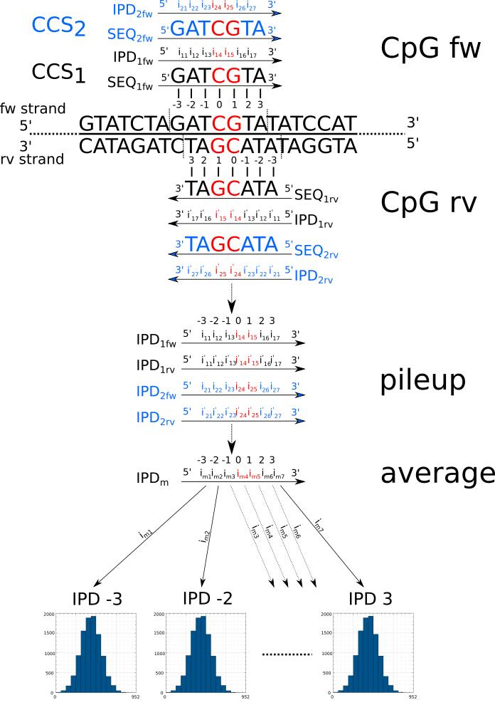
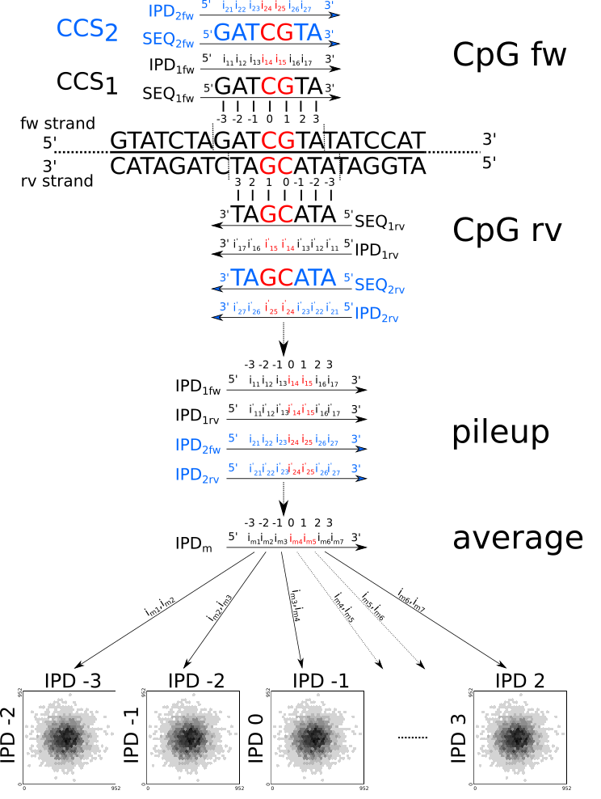

# PacBio kinetic signal and epigenetics
---------------------------------------

This file contains our understanding about PacBio kinetic 
signal encoding, storage and how we have modelled it in 
order to predict epigenetics DNA modifications.

## Table of contents

1.  [About PacBio kinetic signal](#about-pacbio-kinetic-signal)  
2.  [About CpGs](#about-cpgs)  
3.  [Background kinetic model](#background-kinetic-model)  
4.  [Kinetic signal normalization](#kinetic-signal-normalization)  
5.  [Kinetic models](#kinetic-models)  
  5.1. [Raw kinetic model](#raw-kinetic-model)  
  5.2. [Normalized kinetic model](#normalized-kinetic-model)  
  5.3. [Pair-wise kinetic model](#pair-wise-kinetic-model)  
  5.4. [Normalized pair-wise kinetic model](#normalized-pair-wise-kinetic-model)  
  5.5. [Di-position kinetic model](#di-position-kinetic-model)  
  5.6. [Normalized di-position kinetic model](#normalized-di-position-kinetic-model)  
6.  [Acknowledgments](#acknowledgments)  
7.  [Authors](#authors)  

## About PacBio kinetic signal

Currently, here is our understanding of how the kinetic signal is encoded and stored in PacBio CCS BAM files.

- The tag `fi`contains the forward strand IPD values. This is given in the same orientation as `SEQ` when the CCS is unmapped (after mapping `SEQ` always corresponds to the forward reference strand.). Thus, the i-th value of `fi` corresponds to IPD at the i-th position in `SEQ`. See https://ccs.how/faq/kinetics.html.

- The tag `ri` contains the reverse strand IPD values. This is given in the orientation of the the reverse complement sequence of `SEQ`. Thus, the i-th value of `ri` corresponds to IPD at the i-th position in the reverse complement of `SEQ`. This has been determined empirically.

- The tag `fp` contains the forward strand PWD values. It behaves as `fi`.
- The tag `rp` contains the reverse strand PWD values. It behaves as `ri`.

Here is a graphical representation. PWDs are not represented here for clarity (over completness). However, `fi` can be substituted for `fp` and `ri` for `rp` respectively.
```
SEQ  : 5' -- s0, s1, s2, s3, ..., sn -- 3'
fi   : 5' -- fo, f1, f2, f3, ..., fn -- 3'

SEQ' : 5' -- S0, S1, S2, S3, ..., Sn -- 3' (reverse complement of SEQ, not given in BAM file)
ri   : 5' -- r0, r1, r2, r3, ..., rn -- 3'
```

Here is our current understanding regarding mapped CCS.

### forward strand CpG

Here are the two possible situations when the CpG of interest (or any window of interest) is located on the forward strand of the reference.

#### forward strand mapping

The CCS maps on the forward strand. Here is a representation of the different data stored in the CCS.

```
     -------------------------------------------------------------->
  5' f0  f1  f2  f3  f4  f5  f6  f7  f8  f9  f10 f11 f12 f13 f14 f15  3'  fw IPD 
  5' c0  c1  c2  c3  c4  c5  c6  c7  c8  c9  c10 c11 c12 c13 c14 c15  3'  CIGAR
  5' C   C   C   A   A   A   A   C   G   A   A   A   T   C   C   C    3'  SEQ
                 |   |   |   |   |   |   |   |   |   |
  5'  --  ...    A   A   A   A   C   G   A   A   A   T ...        --  3'  FW Reference
  3'  --  ...    T   T   T   T   G   C   T   T   T   A ...        --  5'  RV
  3' r15 r14 r13 r12 r11 r10 r9  r8  r7  r6  r5  r4  r3  r2  r1  r0   5'  rv IPD
```

In this case, the **forward IPDs** are the values of interest.

#### reverse strand mapping

The CCS maps on the **reverse strand**. Here is a representation of the different data stored in the CCS. Note that 
- `SEQ` contains the reference forward strand sequence (according to the regular BAM format specifications)
- the forward IPDs are on the **reverse strand**, along what was the unmapped CCS sequence
- the reverse IPDs are on the forward strand, in the same direction as the forward IPD

```
     ------------------------------------------------------------->
  5' r0  r1  r2  r3  r4  r5  r6  r7  r8  r9  r10 r11 r12 r13 r14 r5   3'  rv IPD 
  5' c0  c1  c2  c3  c4  c5  c6  c7  c8  c9  c10 c11 c12 c13 c14 c15  3'   CIGAR
  5' C   C   C   A   A   A   A   C   G   A   A   A   T   C   C   C    3'   SEQ
                 |   |   |   |   |   |   |   |   |   |
  5'  --  ...    A   A   A   A   C   G   A   A   A   T ...        --  3'  FW Reference
  3'  --  ...    T   T   T   T   G   C   T   T   T   A ...        --  5'  RV
  3' f15 f14 f13 f12 f11 f10 f9  f8  f7  f6  f5  f4  f3  f2  f1  f0   5'  fw IPD
```

In this case, the **reverse IPDs** are the values of interest.


### reverse strand CpG

Here are the two possible situations when the CpG of interest (or any window of interest) is located on the reverse strand of the reference.

#### forward strand mapping

The CCS maps on the forward strand. Here is a representation of the different data stored in the CCS.

```
  5' f0  f1  f2  f3  f4  f5  f6  f7  f8  f9  f10 f11 f12 f13 f14 f15  3'  fw IPD 
  5' c0  c1  c2  c3  c4  c5  c6  c7  c8  c9  c10 c11 c12 c13 c14 c15  3'  CIGAR
  5' C   C   C   A   A   A   A   C   G   A   A   A   T   C   C   C    3'  SEQ
                 |   |   |   |   |   |   |   |   |   |
  5'  --  ...    A   A   A   A   C   G   A   A   A   T ...        --  3'  FW Reference
  3'  --  ...    T   T   T   T   G   C   T   T   T   A ...        --  5'  RV
  3' r15 r14 r13 r12 r11 r10 r9  r8  r7  r6  r5  r4  r3  r2  r1  r0   5'  rv IPD
     <-------------------------------------------------------------
```

In this case, the **reverse IPDs** are the values of interest.

#### reverse strand mapping

The CCS maps on the **reverse strand**. Here is a representation of the different data stored in the CCS. Note that 
- `SEQ` contains the reference forward strand sequence (according to the regular BAM format specifications)
- the forward IPDs are on the **reverse strand**, along what was the unmapped CCS sequence
- the reverse IPDS are on the forward strand, in the same direction as the forward IPD

```
  5' r0  r1  r2  r3  r4  r5  r6  r7  r8  r9  r10 r11 r12 r13 r14 r5   3'  rv IPD 
  5' c0  c1  c2  c3  c4  c5  c6  c7  c8  c9  c10 c11 c12 c13 c14 c15  3'   CIGAR
  5' C   C   C   A   A   A   A   C   G   A   A   A   T   C   C   C    3'   SEQ
                 |   |   |   |   |   |   |   |   |   |
  5'  --  ...    A   A   A   A   C   G   A   A   A   T ...        --  3'  FW Reference
  3'  --  ...    T   T   T   T   G   C   T   T   T   A ...        --  5'  RV
  3' f15 f14 f13 f12 f11 f10 f9  f8  f7  f6  f5  f4  f3  f2  f1  f0   5'  fw IPD
     <-------------------------------------------------------------
```

In this case, **the forward IPDs** are the values of interest.

## About CpGs

A CpG is a dinucleotide sequence 5'-CG-3'. This sequence is paylindromic. Thus for any CpG on the forward strand, there 
is a CpG on the reverse strand, and vice-versa. Because the CpG facing each other on both strands share the same methylation status, CpGs are always considered in pairs: the CpG on the forward strand with its counter part 
on the reverse strand. In this project, whenever it is talked about CpGs, it means a pair of CpG facing each other, as displayed below.

```
           -->
fw 5'- N N C G N N - 3'
rv 3'- N N G C N N - 5'
           <--
```

### CpG pair coordinates

In the following programs, a (pair of) CpG is represented in BED 6 format using the following convention :

**The CpG pair is represented using the coordinates of the forward strand coordinates.**

For instance, if chr1 has a CpG starting at (0-based) position 1000, the CpG pair is reprented as : `chr1 1000  1002  . . +` 
```
         1000 1002
           |   |
           -->
fw 5'- N N C G N N - 3'
rv 3'- N N G C N N - 5'
           <--
```


## Background kinetic model

A background kinetic model contains the average expected IPD and PWD values for all DNA sequences of length $K$, given that is no chemical DNA modification - here 5mC. For a given DNA sequence $SEQ = [s_{1},s_{2},...,s_{K}]$, the model contains an vector of expected IPDs $IPD = [i_{1},i_{2},...,i_{K}]$ and of expected PWDs $PWD = [p_{1},p_{2},...,p_{K}]$. $i1$ and $p1$ are associated to $s_{1}$, $i_{2}$ and $p_{2}$ to $s_{2}$, and so on.

Constructing a kinetic background model is easy and is displayed in the figure below. For clarity, the figure below and this section will only cover the IPD case. However, the PWD normalization follows exactly the same procedure.. In essence, given a CCS of length `L` (bp) that is garanteed to be un-modified by DNA chemical modification, we want to compute the average IPD and PWD signal seen for each possible kmer. 

On a given strand, there are $L-K+1$ slices of $SEQ$ and $IPD$ of length $K$, starting at offsets $1,2,..., L-K+1$. Let us call the slice of $SEQ$ starting at offset $j$ $SEQ[j]$. $SEQ[j]$ has a sequence $S[j]$. Two different slices of $SEQ$ can have the same sequence $S$. For instance if $SEQ=AAACAAA$ and $K=3$ then $SEQ[1]$ and $SEQ[5]$ both have a sequence $S=AAA$. Any slice $SEQ[j]$ is associated with a slice of IPD $IPD[j]$ starting at offset $j$.

All slices of $IPD[j]$ for $j=1,2, ...,L-K+1$ are clustered by the sequence $S$ of their corresponding slice of $SEQ[j]$. Let us call $C(S)$ the cluster of IPD slices associated with a given sequence $S$. The mean IPD slice $mIPD(S)=[m_{1},m_{2},...,m_{K}]$ for $C(S)$ is computed as follow:

```math
mIPD(S)_{i} = \frac {\sum_{j}^{IPD[j] \in C(S)} IPD[j]_{i}} {|C(S)|}

```
where $IPD[j] \in C(S)$ means all slices $IPD[j]$ that belong to cluster $C(S)$.


Constructing a kinetic background from a larger dataset simply require to process each CCS one after the other and to compute the averages over the entire dataset.

For any kinetic background, there are exactly `4**K` kIPD and kPWD values to estimate. Thus, the value of `K` must be choosen according to the size of the dataset (to maximumize the average number of occurence of each kmer) and the complexity of the sequencing data (all kmers must be somewhat equally frequent).

Kinetic background are stored in KmerMap objects ([see KmerMap.hpp](./include/ngsaipp/epigenetics/KmerMap.hpp)).


## Kinetic signal normalization

The kinetic signal normalization is intended to factor in the effect of the DNA sequence in order to keep only kinetic variation that can be attributed to chemical DNA modications, here 5mC. The kinetic normalization procedure is illustrated in the figure below (only IPD normalization is displayed for clarity, this procedure is generalized to PWD values).

Given a background model $B$ containing the expected kinetic signal $mIPD(S)=[m_{1},m_{2},...,m_{L}]$ for any sequence $SEQ=[s_{1},s_{2},...,s_{K}]$ of length $K$, it is possible to normalize the central value of the vector of associated IPD values $IPD=[i_{1},i_{2},...,i_{K}]$. Let us contrain **$K$ to an odd value**. Given this, the central value in $IPD$ in located at index $c=K//2+1$. Its normalization, let us call it $r$, is given by 


```math
r = \frac {i_c} {m_c}
```

To normalize a longer vector of IPD, say of length $L>K$, $IPD=[i_{1},i_{2},...,i_{L}]$, the vector must be broken into $L-K+1$ slices of length $K$. Then the central value of each slice can be normalized using the above described method. Eventually, the resulting IPDR vector will have a final length of $L-K+1$.

In case of a CCS, this process is applied to both strands, for the IPD and the PWD values.


## Kinetic models

For this project, a zoo of models were created to model the kinetic signal (IPD and PWD) around CpGs, in a window of $L$bp (also called size of the model). The C of the CpG is in the center of the window.

In essence, each models contain a set of histograms in their core. These histograms contains the empiric signal distributions, that need to be learnt. Each histogram needs 4 parameters : 1) the x-min, 2) the x-max, 3) the number of bins and 4) the number of pseudo-counts. The number x-min and x-max simply sets which part along the x-axis will be covered with bins. The x-min sets the lower bound (included) of the lowest bin and the x-max sets the upper bound (not included). The number of bins determines how many bins will cover the [x-min,x-max) interval. Finally, the pseudo-count is a count value that will be added to each bin in each histogram of a model at initialisation. This is usefull to avoid empty bins (that can lead to computational issues later on).

The models require CCS data that have been mapped against a genome of reference. The mapping allows to determine all windows centered on a CpG and to treat them.

Let us assume we are given a sequence $SEQ=[s_{1}, s_{2},...,s_{L}]$ containing a CpG in its center and its associated IPDs $IPD=[i_{1}, i_{2},...,i_{L}]$ and of PWDs $PWD=[p_{1}, p_{2},...,p_{L}]$ vectors. If we are also given a model, say $M$, that statistically model the kinetic signal at each position within the window, we can compute the likelihood of the data given the model $p(IPD,PWD,SEQ|M)$. Within the zoo of models, some necessitate only $IPD$ and $PWD$ but not $SEQ$. The models needing $SEQ$ perfom a normalization step of $IPD$ and $PWD$ ([see Kinetic signal normalization](#kinetic-signal-normalization)).

In this project, we want to train a pair of model $M_{meth}$ and $M_{unmeth}$ representing the kinetic signal around methylated and unmethylated CpGs, within a window of $L$bp. The rational is that, if the models are good, in turns, they allow us to compute the a posteriori probability that a CpG is methylated using Bayes'theorem. For this, we need the two models $M_{meth}$ and $M_{unmeth}$, the 3 vectors $IPD$, $PWD$ and $SEQ$ containing the IPD, PWD and DNA sequence around the CpG of interest and $p(meth)$, the a priori probability that any CpG is methylated.

The a posteriori probability of methylation is given by Bayes's theorem:

```math
p(meth | IPD,PWD,SEQ) = \frac {p(IPD,PWD,SEQ|M_{meth})*p(meth)} {p(IPD,PWD,SEQ|M_{meth})*p(meth) + p(IPD,PWD,SEQ|M_{unmeth})*p(unmeth)}
```
where $p(unmeth)=1-p(meth)$.

This value is the methylation prediction score for a CpG. It belongs to the interval [0,1].


### Raw kinetic model

This model is the simplest of all. As shown below (only the IPDs are displayed for clarity but the same holds for PWDs), it models the distribution of IPD and PWD signal seen in a window of $L$ consecutive bp. For this, is uses a collection of $L$ different histograms, each one corresponding to one of the position in the window.

To train the model, we need mapped CCS data and a list of windows within the genome of reference, with a CpG in their center. Then, for each window individually, we extract all the set of CCSs $C$ mapping over the entire window and which have a perfect alignment (no indel allowed) within the window. In the figure below, $C$ contains two CCSs, `CCS1` and `CCS2` (in black and blue respectively). For each CCS, it is possible to extract $SEQ_{fw}$, $SEQ_{rv}$, $IPD_{fw}$ and $IPD_{rv}$ corresponding to the DNA sequence and the corresponding IPD, for each strand, within the window centered on the CpG. All these vectors have length $L$. 

Then it is possible to create a pileup of $L$ columns with all $IPD_{fw}$ and $IPD_{rv}$ vectors from all CCSs. The idea is that each column within the pileup corresponds to a position relative to the CpG. The figure below displays a window with $L=7$bp. The pileup columns correspond to relative position $-3,-2,-1,0,1,2,3$ where $0$ and $1$ (indicated in red below) corresponds to C and G columns.

From the pileup, it is then possible to compute the per-column average IPD value. This results in the creation of a vector of length $L$. This vector can then either be used to fill the $L$ histograms of the model (training) or compute a likelihood.

More details about this model can be in the corresponding header file [RawKineticModel.hpp](./include/ngsaipp/epigenetics/RawKineticModel.hpp)




### Normalized kinetic model

This models is the same as [the raw kinetic model described above](#raw-kinetic-model) with the exception that it normalizes the IPD values before performing the pileup. Thus, a normalized kinetic model necessitates a background model $B$ containing the expected kinetic values for all kmers of length $K<L$. Also, since the normalization "trims" the kinetic vector by $K//2+1$ positions, a model representing a window of $L$bp always extracts $SEQ$ and $IPD$ vectors of length $L+K//2+1$. Hence, the normalization produces a vector of length $L$. 

More details about this model can be in the corresponding header file [NormalizedKineticModel.hpp](./include/ngsaipp/epigenetics/NormalizedKineticModel.hpp)


### Pair-wise kinetic model

The pair-wise kinetic model handles a window of $L$bp by factoring in the model the depencies between all possible positions. The pileup and average steps are exactly the same as for a [raw kinetic model](#raw-kinetic-model). However, instead of consisting of $L$ histograms - 1 per position in the window - it is composed of $\frac{L^2-L}{2}$ histograms. This represent all possible pairs of positions within the window : $(1,2),(1,3),...,(1,L),(2,3),...,(2,L)...,(L-1,L)$.

Also, instead of being regular 1D histograms, the pair-wise kinetic model is composed of 2D histograms. This allows to model the distribution of signal at one position - say the $m$-th - with respects to what happens at the $n$-th (with $m\not=n$). In this case, the $m$-th position will corresponds to one axis of an histogram and the $n$-th position to the second axis of the same histogram. This is displayed in the figure below (only the IPDs are displayed for clarity but the same holds for PWDs). Each histogram in the model is characterized by the same 4 values as for any other model histogram : 1) x-min, 2) x-max, 3) number of bins and 4) pseudo-count. However, instead of determining the "shape" of one axis only, here these value "shape" both axes

Once the average IPD vector has been computed from the pilup, these values can be used to train the model or to compute a likelihood given the model. The training is straigh forward. For a vector of IPDs $IPD=[i_{1},i_{2},...,i_{L}]$ of length $L$, there are $\frac{L^2-L}{2}$ pairs of positions of interest. Each pair $i_{n},i_{m}$ will be used to feed one particular histogram. $i_{n}$ will determine a bin on the 1st axis and $i_{m}$ the bin in the 2nd axis and the corresponding cell in the histogram will receive a count update of +1. The same logic to define bins using the pair $i_{n},i_{m}$ is used to compute a likelihood.

More details about this model can be in the corresponding header file [PairWiseKineticModel.hpp](./include/ngsaipp/epigenetics/PairWiseKineticModel.hpp)


### Normalized pair-wise kinetic model

This models is the same as [the pair-wise kinetic model described above](#pair-wise-kinetic-model) with the exception that it normalizes the IPD values before performing the pileup. Thus, a normalized kinetic model necessitates a background model $B$ containing the expected kinetic values for all kmers of length $K<L$. Also, since the normalization "trims" the kinetic vector by $K//2+1$ positions, a model representing a window of $L$bp always extracts $SEQ$ and $IPD$ vectors of length $L+K//2+1$. Hence, the normalization produces a vector of length $L$. 

More details about this model can be in the corresponding header file [PairWiseNormalizedKineticModel.hpp](./include/ngsaipp/epigenetics/PairWiseNormalizedKineticModel.hpp)


### Di-position kinetic model

The di-position kinetic model is a specialization of the [pair-wise kinetic model](#pair-wise-kinetic-model). Instead of modeling the kinetic signal dependencies between all possible $\frac{L^2-L}{2}$ pairs of positions within the window, it only factors in neighbouring position interactions. There are exactly $L-1$ pairs of neighboring pairs of positions: $(1,2),(2,3),...,(L-1,L)$. Hence, this model is composed of $L-1$ histograms. The same logic developped for the pair-wise kinetic model applies here. Except that there are $L-1$ pairs of IPDs $i_{n},i_{m}$ with $n=m-1$. This is displayed in the figure below (only the IPDs are displayed for clarity but the same holds for PWDs).



More details about this model can be in the corresponding header file [DiPositionKineticModel.hpp](./include/ngsaipp/epigenetics/DiPositionKineticModel.hpp)


### Normalized di-position kinetic model

This models is the same as [the di-position kinetic model described above](#di-position-kinetic-model) with the exception that it normalizes the IPD values before performing the pileup. Thus, a normalized kinetic model necessitates a background model $B$ containing the expected kinetic values for all kmers of length $K<L$. Also, since the normalization "trims" the kinetic vector by $K//2+1$ positions, a model representing a window of $L$bp always extracts $SEQ$ and $IPD$ vectors of length $L+K//2+1$. Hence, the normalization produces a vector of length $L$. 

More details about this model can be in the corresponding header file [DiPositionNormalizedKineticModel.hpp](./include/ngsaipp/epigenetics/DiPositionNormalizedKineticModel.hpp)


## Acknowledgments

Richard Hall and Pacific Biosciences for the discussions
and the shared data.


## Authors

* **Romain Groux**